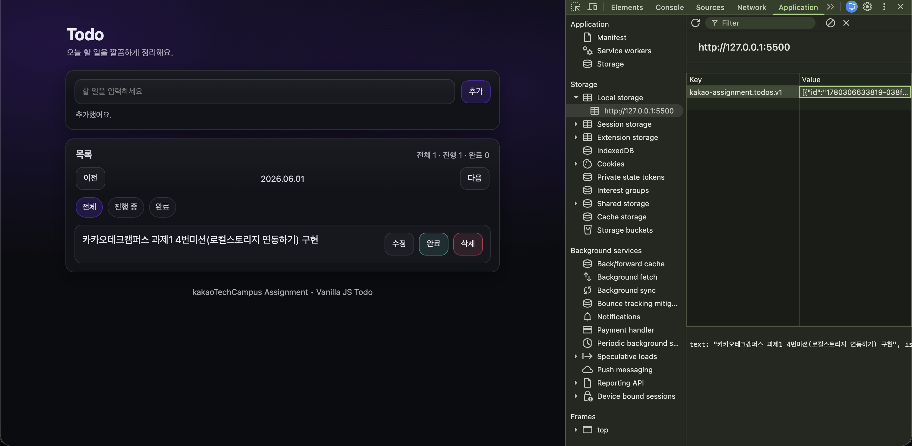

# Todo App (Vanilla JS)

HTML / CSS / Vanilla JS만 사용한 미니멀 Todo 웹 앱입니다.  
메인 컬러는 `#672be0`이며, 상태 기반 렌더링으로 기본 CRUD를 제공합니다.

---

## 1. 첫 번째 커밋

### 구현한 부분
- **Todo 생성(Create)**
  - 입력 폼(submit)에서 텍스트를 받아 Todo를 생성하고 목록에 렌더링
  - 입력값 정규화(앞뒤 공백 제거, 여러 공백을 단일 공백으로)
- **Todo 조회(Read)**
  - `todos` 상태 배열을 기반으로 목록을 렌더링
  - 카운터(전체/진행/완료) 표시
- **Todo 수정(Update)**
  - 수정 버튼 클릭 시 `prompt`로 텍스트 수정 후 상태 갱신 및 재렌더링
- **Todo 완료 토글(Update)**
  - 완료/되돌리기 버튼으로 완료 상태 토글
  - 완료된 항목은 CSS로 취소선 표시
- **Todo 삭제(Delete)**
  - 삭제 버튼 클릭 시 해당 Todo 제거 후 재렌더링
- **입력 검증 및 안내 메시지**
  - 빈 입력은 생성되지 않으며 helper 영역에 안내 메시지 출력(에러 스타일 포함)
- **이벤트 위임**
  - 동적으로 생성되는 목록 버튼(수정/완료/삭제)을 `ul`에 위임하여 처리

### 알게된 부분
- **상태 기반 렌더링 패턴**
  - 배열 상태를 갱신하고 `render()`로 UI를 다시 그리는 방식이 로직을 단순하게 만든다.
- **이벤트 위임의 필요성**
  - 동적으로 생성되는 요소는 부모에 이벤트를 걸고 `data-*` 속성으로 동작을 분기하는 것이 안정적이다.
- **XSS 방지의 기본**
  - 사용자 입력을 innerHTML로 넣을 때는 최소한의 이스케이프가 필요하다.

### AI의 도움을 받은 부분
- 전체 앱의 **레이아웃 구조(index.html)** 구성(헤더/입력 카드/목록 카드/푸터 배치)
- 미니멀 생산성 앱 스타일의 **컬러/여백/카드 UI/버튼/리스트 스타일(style.css)** 설계
- CRUD 구현 시 **이벤트 위임 구조와 기본 렌더링 패턴(app.js)**의 뼈대 정리
- (주의) 핵심 기능 로직은 직접 이해/검증 후 적용했고, 레이아웃/배치 등 반복 작업 위주로 코파일럿을 참고함

---

## 2. 두 번째 커밋

### 구현한 부분
- **상태별 필터 탭 UI 추가**
  - `전체 / 진행 중 / 완료` 3가지 탭을 추가하여 원하는 상태의 Todo만 볼 수 있게 함
- **필터 상태에 따른 목록 렌더링**
  - 현재 선택된 필터를 `currentFilter`로 관리
  - `getFilteredTodos()`로 필터 조건에 맞는 Todo만 화면에 표시
- **활성 탭 시각적 구분**
  - 선택된 탭에 `.is-active` 클래스를 적용하여 스타일로 구분
  - `aria-pressed` 값을 함께 갱신하여 접근성 개선
- **필터 유지**
  - 탭을 바꾼 뒤 Todo를 추가해도 `currentFilter`가 유지되어 현재 탭 기준으로 계속 렌더링됨

### 알게된 부분
- **UI 상태도 앱 상태로 관리해야 예측 가능한 동작이 된다**
  - "현재 어떤 탭을 보고 있는가" 같은 UI 정보도 상태로 들고 있으면, 추가/수정/삭제 후에도 일관된 화면을 유지할 수 있다.
- **필터링은 데이터 변화가 아니라 '표시 방식'의 변화**
  - `todos` 원본을 변경하지 않고, 렌더링 단계에서만 필터링된 배열을 만들어 보여주는 방식이 안전하다.

### AI의 도움을 받은 부분
- 필터 탭 UI의 기본 마크업 구조(index.html) 및 버튼 배치 아이디어 참고
- 필터 탭(칩 형태)의 기본 스타일(style.css) 구성 참고
- 필터링 로직을 함수로 분리(`getFilteredTodos`, `setActiveFilterTab`)하는 구조 정리 참고

---

## 3. 세 번째 커밋

### 구현한 부분
- **Todo 일간 뷰(날짜별 분리)**
  - 선택된 날짜를 상태로 관리하고, 해당 날짜의 Todo만 목록에 표시
  - `이전 / 다음` 버튼으로 날짜를 이동할 수 있게 구성
- **Todo 생성 시 날짜 저장**
  - Todo 객체에 `dateKey(YYYY-MM-DD)`를 저장하여, 날짜 이동 시 서로 다른 목록이 보이도록 분리
- **기존 기능(필터/CRUD)과 결합**
  - 날짜 필터링을 먼저 적용한 뒤 상태 필터(전체/진행/완료)를 적용하여, 일간 뷰 안에서도 필터 탭이 동일하게 동작

### 알게된 부분
- **필터 조건이 여러 개일 때는 적용 순서가 중요하다**
  - "선택 날짜"와 "완료 상태"처럼 조건이 겹치면, 먼저 범위를 좁히는 필터(날짜)를 적용한 뒤 세부 필터(상태)를 적용하는 게 이해하기 쉽다.
- **저장용 포맷과 표시용 포맷을 분리하면 유지보수가 편하다**
  - 내부 저장은 `YYYY-MM-DD`처럼 비교하기 쉬운 형태로 두고, 화면 표시는 사용자 친화적인 형태로 변환하는 방식이 깔끔하다.

### AI의 도움을 받은 부분
- 일간 뷰 UI(날짜 표시 + 이전/다음 버튼) 배치 아이디어 참고
- 날짜 키(`YYYY-MM-DD`)를 만드는 유틸 함수와 날짜 이동 로직 구성 참고
- 기존 상태 필터 로직에 "날짜 필터"를 결합하는 함수 분리 방식 참고

---

## 4. 네 번째 커밋

### 구현한 부분
- **로컬스토리지 연동(데이터 유지)**
  - `todos` 상태를 `localStorage`에 JSON 형태로 저장하고 복원하여 새로고침 후에도 목록이 유지되도록 구성
  - Todo **추가 / 수정 / 삭제 / 완료 토글**처럼 상태가 바뀌는 시점마다 저장되도록 정리
  - 데이터는 `JSON.stringify` / `JSON.parse`를 사용해 직렬화/역직렬화

### 알게된 부분
- **저장 책임을 상태 변경 지점에 두면 누락이 줄어든다**
  - 렌더링 이후가 아니라, `todos`를 실제로 바꾸는 함수(add/edit/toggle/delete)에서 저장하면 흐름이 단순하다.
- **외부 저장소(localStorage)는 항상 실패/오염 가능성을 고려해야 한다**
  - `JSON.parse` 예외나 데이터 형태가 깨진 케이스를 감안해 기본값/방어 로직이 필요하다.

### AI의 도움을 받은 부분
- 로컬스토리지 저장/복원 흐름을 함수로 분리하는 방식과 예외 처리 구조 참고
- 저장 키 네이밍과 데이터 구조 정리 참고

---

## 5. 다섯 번째 커밋

### 구현한 부분
- **Todo 주간 뷰(월요일~일요일)**
  - 이번 주 월요일부터 일요일까지의 날짜를 가로로 나열하여 보여주도록 구성
  - `이전 주 / 다음 주` 버튼으로 주차를 이동할 수 있게 구성
- **날짜별 Todo 표시**
  - 날짜를 클릭하면 해당 날짜의 Todo만 목록에 표시되도록 구현
  - 선택된 날짜를 기준으로 기존 필터(전체 / 진행 중 / 완료)도 함께 동작하도록 구성
- **날짜별 Todo 개수 표시**
  - 각 날짜 아래에 해당 날짜의 Todo 개수를 표시하도록 구성
- **오늘 날짜 강조**
  - 오늘 날짜는 다른 날짜와 구분되도록 시각적 스타일을 적용

### 알게된 부분
- **주간 뷰는 날짜 계산 기준을 분리하는 것이 중요하다**
  - 시작 날짜와 선택 날짜를 분리해서 관리하니 주차 이동과 날짜 선택이 더 명확해졌다.
- **개수 표시는 화면 상태와 데이터 상태를 함께 반영해야 한다**
  - 날짜별 Todo 개수는 렌더링 시점마다 다시 계산해야 정확하게 유지된다.

### AI의 도움을 받은 부분
- 주간 날짜를 가로로 배치하는 UI 구조와 주차 이동 방식 참고
- 날짜 클릭 시 목록을 갱신하는 이벤트 연결 방식 참고
- 오늘 날짜 강조와 날짜별 개수 표시 스타일 구성 참고
